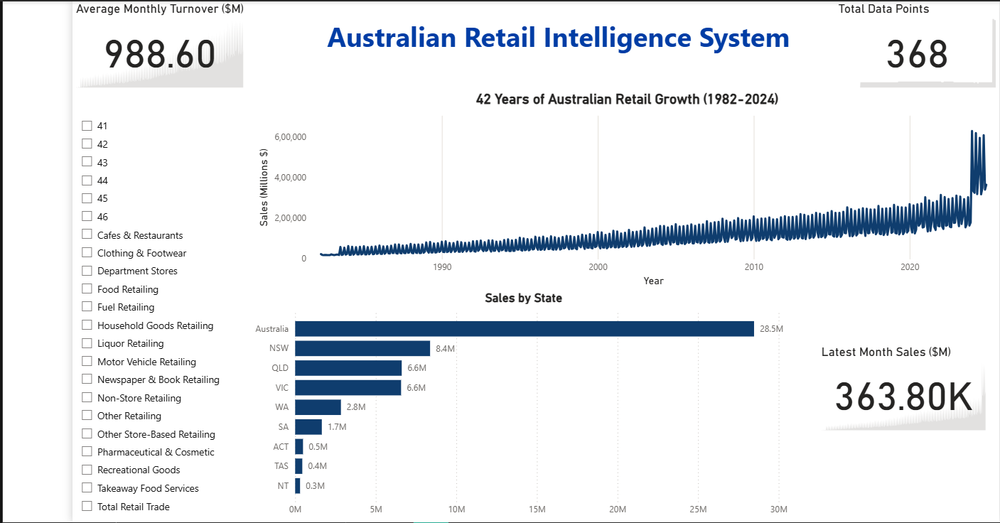

# Australian Retail Intelligence

An end-to-end forecasting platform over **42 years of ABS retail trade data**
(1982–2024): a Python ETL pipeline, 192 Prophet models, and a **live FastAPI
service** backing a Power BI dashboard.

**▶ Live API:** https://australian-retail-intelligence-1.onrender.com ·
[interactive docs](https://australian-retail-intelligence-1.onrender.com/docs)
_(free tier — the first request may cold-start for ~30–60s)_



## Pipeline

`ABS SDMX API → Python ETL → PostgreSQL (Neon) → Prophet → FastAPI → Power BI`

- **ETL** — pulls the full ABS Retail Trade dataset (**342,747 raw records**),
  filters to original-terms turnover (M1 / TSEST 20 → 101,574), cleans and
  computes year-on-year growth → **93,578 clean monthly records** across 22
  retail categories and 9 states/territories.
- **Forecasting** — one Prophet model per category/state series with ≥24 months
  of history (**192 models**), each projecting 12 months → **2,304 forecasts**,
  with yearly seasonality and Australian public holidays.
- **Serving** — a FastAPI service exposes historical sales and forecasts over a
  REST API, backed by PostgreSQL on Neon.

## Forecast accuracy (reproducible)

Six-month hold-out backtests — train on all but the last 6 months, predict, then
measure MAPE against the held-out actuals:

| Scope | Mean MAPE | Notes |
|---|---|---|
| **All 192 series** | **7.28%** | median 5.11%; best 0.42%, worst 58.48%; 81% of series under 10% |
| 5 highest-volume series | 1.35% | best **0.60%**, worst **3.14%** |

The largest errors come from small, sparse series; high-volume totals forecast
tightly. Reproduce it offline (no database required) — the committed data and
script regenerate `results/metrics.json`:

```bash
python src/forecast/evaluate_all_offline.py
```

## API endpoints

| Endpoint | Returns |
|---|---|
| `GET /sales` | historical monthly turnover (filter by category / state / date) |
| `GET /forecasts` | 12-month forecasts with 95% confidence intervals |
| `GET /categories`, `/states` | code → name lookups |
| `GET /health` | service + database status |
| `GET /docs` | interactive OpenAPI documentation |

## Stack

Python (pandas, Prophet) · PostgreSQL (Neon) · FastAPI · SQLAlchemy · Render · Power BI

## Data

Australian Bureau of Statistics — Retail Trade, via the
[ABS SDMX API](https://api.data.abs.gov.au). April 1982 – December 2024.

---

**Tauseef Mohammed Aoun** — Master of Data Science, Monash University
· [GitHub](https://github.com/Tauseef-hub) · [LinkedIn](https://www.linkedin.com/in/tauseef-aoun)
